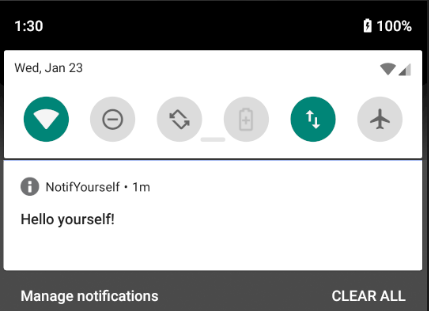

# NotifYourselfCLI
NotifYourselfCLI makes sending notifications to your mobile phone easy. Just follow these simple steps:

* Install NotifYourselfCLI on your sending machine
* Install the NotifYourself android app from Play Store or compile it yourself
* Find your token in the configuration page of the app
* Run `notifyourself -T <token> "Hello yourself!"` to send yourself a notification




You can use this to push yourself a message when your long running simulation, nn-training or calculation is finished:
```
$ longRunningCalculation.sh && notifyourself "Job finished :)"
```

# Installation

Simply use pip to install notifyourself:

```
$ python -m pip install notifyourself
```

## Using source direclty
You can also just use the [python script source](https://github.com/wchresta/NotifYourselfCLI/blob/master/notifyourself/notifyourself.py) directly; make sure you install the `requests` package: `python -m pip install requests`

# Configuration

Configuration is done using the file `~/.config/notifyourself/config.ini` (or `%USERPROFILE%\.config\notifyourself\config.ini` on Windows).

```ini
# notifYourself configuration
#
# You can define multiple targets with different tokens and use
# the -t flag to choose one. Default is the DEFAULT target.

[DEFAULT]
# Use your notifYourself app to find this token
token=

# [ANOTHER_TARGET]
# token=ANOTHER_TARGETS_TOKEN
```

# Usage

```
usage: notifyourself [-h] [-T TOKEN | -t TARGET] [--config CONFIG]
                     title [body]

Send a notification to your phone

positional arguments:
  title                 Notification title
  body                  Longer message in the body of the notification

optional arguments:
  -h, --help            show this help message and exit
  -T TOKEN, --token TOKEN
                        Use this token to send the message
  -t TARGET, --target TARGET
                        Send message to this target phone specified in the
                        config file
  --config CONFIG       Configfile to use instead of default
```

## Examples

* Send a short result with the notification

```
$ echo "42" > ./result
$ notifyourself "Job's finished :)" "Result: $(cat ./result)"
```

* Change the token

```
$ notifyourself -T "longlong:token-foobar" "It works :)"
```

* Have multiple phones preconfigured

```
$ cat ~/.config/notifyourself/config.ini 
# notifYourself configuration
#
# You can define multiple targets with different tokens and use
# the -t flag to choose one. Default is the DEFAULT target.

[DEFAULT]
# Use your notifYourself app to find this token
token=foobarbaz1

[ANOTHER_TARGET]
token=target2token

$ notifyourself -t ANOTHER_TARGET "This shows in the other one"
```

